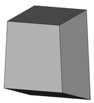
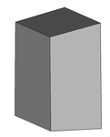
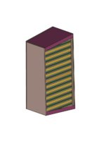
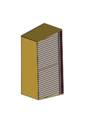
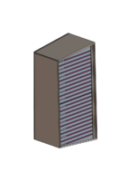
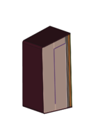

[](https://www.python.org)
[](https://travis-ci.org/ukaea/breeder_blanket_model_maker)

- [Design goals](#design-goals)
- [Features](#features)
- [Installation](#installation)
- [Installation of dependencies](#installation-of-dependencies)
- [Getting started](#getting-started)
- [Making HCPB blankets](#making-hcpb-blankets)
- [Making HCLL blankets](#making-hcll-blankets)
- [Making WCLL blankets](#making-wcll-blankets)
- [Making DCLL blankets](#making-dcll-blankets)
- [Todo](#todo)

# <a name="design-goals"></a>Design Goals

Breeder_blanket_model_maker is a parametric 3D geometry maker for creating detailed CAD designs of breeder blankets. The main goals of the software are:
  - Automate the process of creating different blanket models
  - Accelerate the use of parametric design in fusion
  - Ease the process of optimising blanket designs across disciplines

# <a name="features"></a>Features

  - Create detailed parametric HCPB, HCLL and WCLL blanket designs
  - Import a blanket envelope model and start forming parts from it
  - Export geometries of different components in STEP, STL and h5m format
  - Export first wall armour with your specified thickness
  - Export a first wall with a specified thickness and optional cooling channels
  - Export end caps with a specified thickness
  - Export the desired number of rear walls with desired thicknesses
  - Export polodially segmented breeder zones with uniform or repeating structures
  - Export radially segmented breeder zones with uniform or repeating structures
  - Export toroidally segmented breeder zones with uniform or repeating structures

# <a name="installation"></a>Installation

- install the package using pip
```sh
$ pip install breeder_blanket_model_maker
```

- Alternatively install the package by cloning this git repository and install locally
```sh
$ git clone git@github.com:ukaea/breeder_blanket_model_maker.git
$ cd breeder_blanket_model_maker
$ python setup.py install
```
### <a name="installation-of-dependencies"></a>Installation of dependencies

Breeder_blanket_model_maker relies on a number dependencies of to work properly:
* [FreeCAD](https://www.freecadweb.org) -  a fully programmable open source parametric 3D modeler
* [Python](https://www.python.org) - a programming language that lets you work quickly and integrate systems more effectively, currently the only Python 2 is supported.
* [Trelis](http://www.csimsoft.com) - (optional) programmable meshing software that also performs imprint and merge operations required for non overlapping STL geometry.


You can [install the latest release of FreeCAD](https://www.freecadweb.org/wiki/Installing) in Ubuntu with the following command :

```sh
sudo apt-get install freecad
```

Alternatively you can install the most recent pre-release version straight from the repository with these commands:
```sh
$ sudo apt-get install software-properties-common python-software-properties
$ sudo add-apt-repository ppa:freecad-maintainers/freecad-daily
$ sudo apt-get update
$ sudo apt-get install freecad-daily && sudo apt-get upgrade
```

You will also need Python installing, currently FreeCAD is supported best by Python 2 and a Python 3 version is under intense development. I hope to upgrade this repository to Python3 soon. To install Python 2 and pip
```sh
$ wget https://www.python.org/ftp/python/2.7.14/Python-2.7.14.tar.xz
$ tar -xvf Python-2.7.14.tar.xz
$ cd Python-2.7.14
$ ./configure
$ make
$ make test
$ sudo make install
$ wget https://bootstrap.pypa.io/get-pip.py
$ python get-pip.py

```

Installation of Trelis is best described on the [CSimSoft website](http://www.csimsoft.com/). The DAGMC Trelis plugin is also required and available on the [DAGMC website](https://svalinn.github.io/DAGMC/install/plugin.html)  

# <a name="getting-started"></a>Getting started

In general to make a detailed breeder blanket you simply import the breeder_blanket_model_maker decide upon the dimensions of various components and provide a blanket envelope. The following code is incomplete but provides a skeleton example.

```python
from breeder_blanket_model_maker import *

blanket_geometry_parameters =  {
# identify a blanket type (WCLL, HCLL, HCPB, HCLL)
...
# assign dimensions to all required components
...
# provide a blanket envelope
}
detailed_module(blanket_geometry_parameters)
```

Two example blanket envelopes are provided with the package for users to experiment with. These can be used by setting the *envelope_filename* equal to "sample_envelope_1.step" or "sample_envelope_2.step". Sample 1 and 2 differ in terms of their position in the reactor.





### <a name="making-hcpb-blankets"></a>Making HCPB blankets

To make a Helium Cooled Pebble Bed Blanket (HCPB) the package must be imported. The envelope filename must be specified, here we use one of the example envelopes. The output folder for generated STL, STEP and h5m files must be specified. The dimensions of various components must also be stated. The order of the back walls and poloidal segmentations is important so and orderedDict type has been used (Python 2 does not preserve order of dictionaries). Here is an example input:

```python
from breeder_blanket_model_maker import *

blanket_geometry_parameters =  {
    'blanket_type' : 'HCPB',
    'envelope_filename' : 'sample_envelope_1.step',
    'output_folder' : 'detailed_HCPB',
    'first_wall_poloidal_fillet_radius' : 50,
    'armour_thickness' : 2,
    'first_wall_thickness' : 25,
    'end_cap_thickness' : 25,
    'back_walls_thicknesses' : OrderedDict({'back_wall_1':30,
                                            'back_helium_1':50,
                                            'back_wall_2':30,
                                            'back_helium_2':25,
                                            'back_wall_3':10}),
    'poloidal_segmentations' : OrderedDict({'neutron_multiplier':60,
                                            'cooling_plate_1':5,
                                            'breeder_material':15,
                                            'cooling_plate_2':5}),
    # 'cooling_channel_offset_from_first_wall': 3,
    # 'first_wall_channel_radial_mm': 13.5,
    # 'first_wall_channel_poloidal_segmentations': OrderedDict({'first_wall_material':13.5,
    #                                                          'first_wall_coolant':4.5})                                            
    }

detailed_blanket(blanket_geometry_parameters)
```
Running the above code will generate a 3D detailed blanket design for your envelope. A slice through the resulting geometry will looks like the following image:

<a name="images/HCPB.pdf"></a>

Additional detail can be added by uncommenting *cooling_channel_offset_from_first_wall*, *first_wall_channel_radial_mm* and *first_wall_channel_poloidal_segmentations* from the above example.


### <a name="making-hcll-blankets"></a>Making HCLL blankets

Helium Cooled Lithium Lead (HCLL) blankets take similar input parameters to the previous HCPB example. Again the first wall cooling channels are commented out on this example but they can be uncomment for additional detail.

```python
blanket_geometry_parameters =  {
    'blanket_type' : 'HCLL',
    'envelope_filename' : 'sample_envelope_1.step',,
    'output_folder' : 'detailed_HCLL',
    'first_wall_poloidal_fillet_radius' : 50,
    'armour_thickness' : 2,
    'first_wall_thickness' : 20,
    'end_cap_thickness' : 25,
    'back_walls_thicknesses' : OrderedDict({'back_wall_1':30,
                                            'back_helium_1':50,
                                            'back_wall_2':30,
                                            'back_lithium_lead':25,
                                            'back_wall_3':10}),
    'poloidal_segmentations' : OrderedDict({'lithium_lead':30,
                                            'cooling_plate_1':50})

    # 'cooling_channel_offset_from_first_wall': 3,
    # 'first_wall_channel_radial_mm': 13.5,
    # 'first_wall_channel_poloidal_segmentations': OrderedDict({'first_wall_material':13.5,
    #                                                          'first_wall_coolant':4.5})
}

detailed_blanket(blanket_geometry_parameters)
```
Running the above code will generate a 3D detailed blanket design for your envelope. A slice through the resulting geometry will looks like the following image:

<a name="images/HCLL.pdf"></a>

### <a name="making-wcll-blankets"></a>Making WCLL blankets

To make a Water Cooled Lithium Lead (WCLL) blanket additional parameters are need *toroidal_segmentations* and *radial_segmentations* are needed. Radial segmentation is the offset from the first wall that every other structural plate is cut with.

```python
from breeder_blanket_model_maker import *

blanket_geometry_parameters =  {

    'blanket_type' : 'WCLL',
    'envelope_filename' : 'sample_envelope_1.step',
    'output_folder' : 'detailed_WCLL',
    'first_wall_poloidal_fillet_radius' : 50,
    'armour_thickness' : 2,
    'first_wall_thickness' : 25,
    'end_cap_thickness' : 25,
    'back_walls_thicknesses' : OrderedDict({'back_wall_1':15,
                                            'back_wall_2':30,
                                            'back_wall_3':15,
                                            'back_wall_4':30,
                                            'back_wall_5':15}),
    'poloidal_segmentations' : OrderedDict({'lithium_lead':25,
                                            'structural_plate':5}),
    'toroidal_segmentations' : OrderedDict({'lithium_lead':25,
                                            'structural_plate':5}),
    'radial_segmentations' : [150],
}

detailed_module(blanket_geometry_parameters)
```
Running the above code will generate a 3D detailed blanket design for your envelope. A slice through the resulting geometry will looks like the following image:

<a name="images/WCLL.pdf"></a>

### <a name="making-dcll-blankets"></a>Making DCLL blankets

To make the Duel Cooled Lithium Lead (DCLL) additional parameters are needed. *poloidal_upper_offset_for_breeder_channel* and *poloidal_lower_offset_for_breeder_channel* are the space provided for upper and lower lead flow channels.

```python
from breeder_blanket_model_maker import *

blanket_geometry_parameters =  {

    'blanket_type' : 'DCLL',
    'envelope_filename' : 'sample_envelope_1.step',
    'output_folder' : 'detailed_'+blanket_type,
    'first_wall_toroidal_fillet_radius':50,
    'armour_thickness':2,
    'first_wall_thickness':25,
    'end_cap_thickness':25,
    'back_walls_thicknesses':OrderedDict({'back_wall_1':20,
                                            'back_wall_2':10,
                                            'back_helium_1':45,
                                            'back_wall_3':10,
                                            'back_helium_2':45,
                                            'back_wall_4':10,
                                            'back_wall_5':20}),
    'toroidal_segmentations' : OrderedDict({'lithium_lead':25,
                                            'structural_plate':5}),
    'radial_segmentations':[250, 15],
    'poloidal_upper_offset_for_breeder_channel':150,
    'poloidal_lower_offset_for_breeder_channel':150,

    # 'cooling_channel_offset_from_first_wall': 3,
    # 'first_wall_channel_radial_mm': 13.5,
    # 'first_wall_channel_toroidal_segmentations': first_wall_channel_toroidal_segmentations_dict,  # 13.5,4.5

}

detailed_module(blanket_geometry_parameters)
```
Running the above code will generate a 3D detailed blanket design for your envelope. A slice through the resulting geometry will looks like the following image:

<a name="images/DCLL.pdf"></a>


### <a name="todo"></a>Todo
 - Write MORE Tests
 - Write user documentation for first wall cooling and slice gemoetry
 - Generate unstrucutred mesh of geometry
